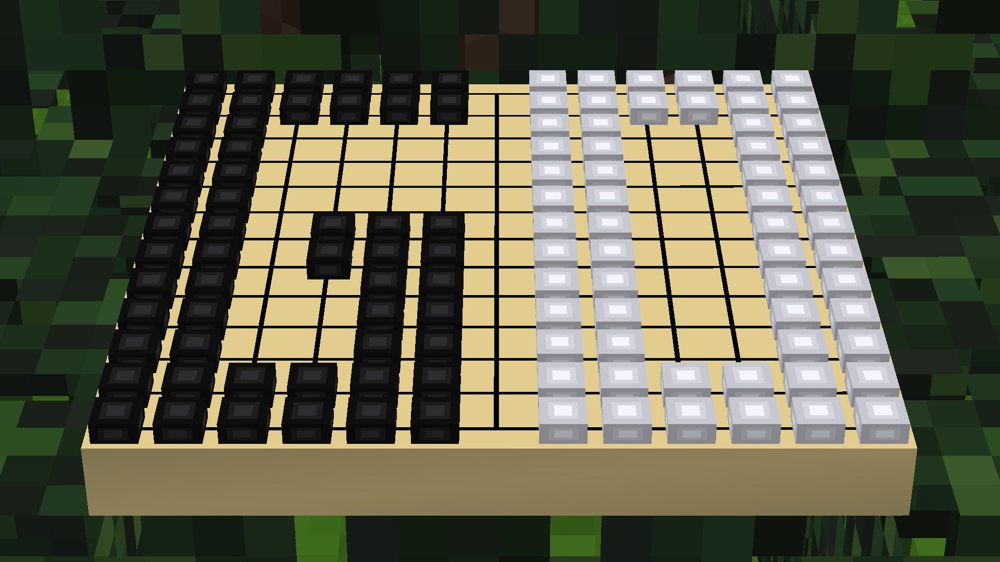

# Go

A game of Go for Minetest.

## Instructions

How to play a game of Go:

1. Craft Go boards & (infinite) stones
2. Place a Go board
3. Make a move or pass (either right-click the board to open the formspec, then click on an intersection or right-click with infinite Go stones of the appropriate color)
4. Wait for your opponent to make a move (or pass)
5. Go back to step 3
6. After both you and your opponent have passed consecutively the marking phase begins
7. Mark captured groups (only if any groups remain that don't have two eyes; otherwise the board is scored immediately)
8. Wait for your opponent to mark captured groups
9. After both you and your opponent have accepted which groups were marked as captured, proceed to scoring
10. Reset the board

Using a bare hand, the board can be picked up at any time (only the protection owner can pick it up if the location where it resides is protected). The full game state will be kept by the item - simply place the board again to resume the game.

### Rules

Standard [Rules of Go](https://en.wikipedia.org/wiki/Rules_of_Go), where the following choices have been made:

* Basic ("japanese") ko rule, but no super ko rules
* Area ("chinese") scoring; games should ideally be played out (no neutral area left at the end of the game, all groups have two eyes) - otherwise groups need to be marked as captured manually

## Dependencies

Required ("hard") dependencies:

* [`modlib`](https://github.com/appgurueu/modlib)
* [`fslib`](https://github.com/appgurueu/fslib)

Optional development dependencies:

* [`strictest`](https://github.com/appgurueu/strictest)
* [`dbg`](https://github.com/appgurueu/dbg)

Optional "hinted" dependencies that may provide items for crafts (various alternatives exist):

* [`default`](https://github.com/minetest/minetest_game/tree/master/mods/default)
* [`dye`](https://github.com/minetest/minetest_game/tree/master/mods/dye)

both are part of [Minetest Game](https://github.com/minetest/minetest_game) and most derivatives.

Note that technically these mods don't have to load first for Go to work, hence they are only "hinted".

Optional, supported dependencies:

* [`visible_wielditem`](https://github.com/appgurueu/visible_wielditem)

Other recommendations:

* [`craftguide`](https://content.minetest.net/packages/jp/craftguide/) for viewing the recipes
* [`i3`](https://content.minetest.net/packages/jp/i3/) an aesthetic inventory mod containing a crafting guide

### Crafting

For the craft recipes, items with the following groups are required:

* `group:wood` and `group:dye,color_black` for boards;
* `group:stone` and and `group:dye,color_black` for black stones;
* `group:stone` and and `group:dye,color_white` for white stones

if no items of a group are available, items that use the group in their craft won't be craftable.

## Engine Limitations

The options for implementing in-game Go boards are the following:

* Use entities for stones. Not feasible at all due to entities being very heavy.
* Change the texture of the board as stones are placed; mix & match texture modifiers and dynamic media. Fills up the client cache; textures would get very large if stone textures are more than just a single color.
* Have two stones for every position hidden inside the board, move one up using a bone offset. Puts some strain on the network for sending the update bone position commands but is rather fine other than that & doesn't leak memory. Many boards will eventually lead to FPS drops as skeletal animation is implemented rather inefficiently, running on the CPU. **This is what this mod uses.**

In the formspec stones would flicker the moment they are placed if styles were used for immediate feedback. This is because as soon as you stop pressing, the hovered state will be shown again until the new formspec reaches you. Elements that stay pressed (i.e. checkboxes) don't support the necessary styling yet. Thus placing stones has a certain "lag" to it.

Another limitation is that no settings (or defaults) can be forced by a mod or game (apart from editing the global settings, which is extremely dirty and error-prone). Thus decent settings have to be recommended:

## Recommended Settings

* Enabling *shaders* (`enable_shaders = true`) is highly recommended to enhance the 3D look & feel of the board
* *Entity selectionboxes should be hidden* (`show_entity_selectionbox = false`); if entity highlighting is used, it should *not be set to halo*, but rather to *outline* (`node_highlighting = box`) as to not obstruct the view on the board
* *Smooth GUI image scaling* should be enabled (`gui_scaling_filter = true`)
* Enable *trilinear texture filtering* (`trilinear_filter = true`), *mipmapping* (`mip_map = true`) & *anisotropic filtering* (`anisotropic_filter = true`) for smoother board appearance
* **Consider** enabling *multi-sample anti-aliasing* (`msaa = 2`) for smooth board edges **if it doesn't [trigger a nasty rendering bug](https://github.com/minetest/minetest/issues/9072) on your setup**

You can set these settings by adding the following lines at the end of your configuration file (`minetest.conf`):

	enable_shaders = true
	show_entity_selectionbox = false
	gui_scaling_filter = true
	trilinear_filter = true
	mip_map = true
	anisotropic_filter = true

(MSAA not included due to the aforementioned bug)

Additionally, when playing using the formspec, first hiding the HUD (usually by pressing <kbd>F1</kbd>) is recommended.

---

Language Support:

* English: 100%
* German: 100%

---

Links: [GitHub](https://github.com/appgurueu/go), [ContentDB](https://content.minetest.net/packages/LMD/go), [Minetest Forums](https://forum.minetest.net/viewtopic.php?t=28401)

License:

* Code: Written by Lars Müller and licensed under the **MIT** license
* Media: **CC0 & CC-BY 3.0** as follows:
  * Models, textures & locales: Own work, all licensed CC0
  * Sounds:
    * `go_board_place.ogg`: OGG version of a [`put_item.wav`](https://freesound.org/people/j1987/sounds/335751/) by [`j1987`](https://freesound.org/people/j1987), licensed under the CC0 license
    * `go_stone_place.1.ogg`, `go_stone_place.2.ogg`: Derivatives of [`Glass Place 2.wav`](https://freesound.org/people/kelsey_w/sounds/467057/) by [`kelsey_w`](https://freesound.org/people/kelsey_w/), licensed under CC-BY 3.0
    * `go_stone_place.3.ogg`: Derivative of [`Glass Pick Up & Place.wav`](https://freesound.org/people/kelsey_w/sounds/467043/) by [`kelsey_w`](https://freesound.org/people/kelsey_w/), licensed under CC-BY 3.0
